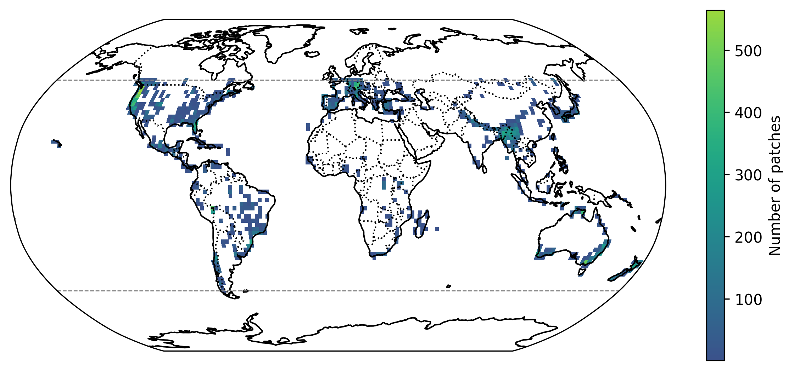
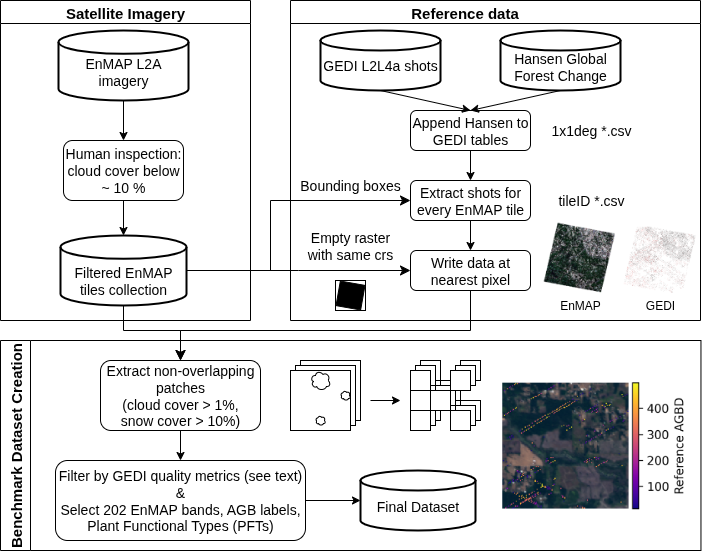
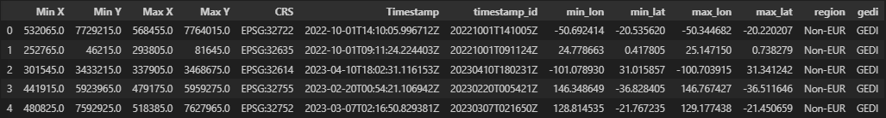

# HyBiomass 🌳

[[`Paper published in IEEE GRSL`](https://ieeexplore.ieee.org/document/11164504)]
[[`BibTeX`](#citation)]

This repository contains the code associated with the paper: [HyBiomass: Global Hyperspectral Imagery Benchmark Dataset for Evaluating Geospatial Foundation Models in Forest Aboveground Biomass Estimation](https://ieeexplore.ieee.org/document/11164504).

> **Note:** The codebase is based on [ashleve/lightning-hydra-template](https://github.com/ashleve/lightning-hydra-template) for the experiments part.

## Overview

HyBiomass is a globally-distributed benchmark dataset for forest aboveground biomass (AGB) estimation. This dataset combines co-located hyperspectral imagery from the EnMAP satellite and predictions of AGB density estimates derived from the GEDI lidars, covering seven continental regions.

<p align="center">
<div style="text-align:center">
    <figure>
        
        <br>
        <figcaption>
        <strong>Geographic distribution of patches in the dataset.</strong>
        </figcaption>
    </figure>
</div>
</p>

This repository contains the source code to create the dataset, aswell as the code to run the benchmarking experiments presented in the paper.


## Data Access

The dataset will soon be made available through the DLR GeoService Portal, for which an account has to be created.


## Installation

To set up the environment and install the required dependencies, follow these steps.

**Clone the repository & install required packages:**
   ```bash
   git clone https://github.com/a-banze/HyBiomass
   cd hybiomass

   pip install torch==2.0.0
   pip install -e .
   ```


## Dataset creation

The dataset can be created with the following steps.

<p align="center">
  
</p>

### 0. Initialization

Create directories that are ignored by git:

```bash
mkdir -p logs raw_data/enmap raw_data/gedi
```

Make sure you have a directory containing the EnMAP tiles for the project. Every tile should have its own directory.

Make sure you have a table with the corresponding timestamps and bounding boxes for all EnMAP tiles.

Add your working directory to /hybiomass/dataset_creation/utils.

### 1. Preparing the table with EnMAP tiles unique identifiers, timestamps and (reprojected) coordinates

Edit the `config/enmap/enmap_table.yaml` config file:
- `enmap_dir` (str): relative path to the table with bboxes and timestamps of EnMAP tiles to process
- `input_filename` (str): file name of the input CSV file
- `output_dir` (str): relative path where to save the output
- `output_filename` (str): file name of the output CSV file with the reprojected coordinates


Run the script:

```bash
python scripts/preprocessing/prepare_enmap_tiles_table.py
```
The output table will look like this:

<p align="center">
  
</p>

### 2. Appending Hansen data to the GEDI L2L4a tables

This step assumes that GEDI L2L4a tables have been downloaded using the `scripts/download/download_GEDIlv002_L2L4a.sh` script and the Hansen Global Forest Change 2023 v1.11 rasters using the `scripts/download/download_hansenGFC.sh` script.

This step appends the Hansen data to the GEDI L2L4a tables. The output is a new table with the same columns as the original GEDI L2L4a table plus the Hansen data columns.

Edit the `config/hansen/processor.yaml` config file:
- `products` (list): Hansen layers to append to the GEDI L2L4a tables
- `hansen_dir` (str): absolute path to Hansen Global Forest Change 2023 v1.11 files
- `l2l4a_dir` (str): absolute path to downloaded GEDIlv002_L2L4a data tables
- `output_dir` (str): absolute path to where the output tables will be stored
- `num_workers` (int): number of CPUs to use for parallel processing.

Run the script:

```bash
python scripts/preprocessing/append_hansen_to_l2l4a_tables.py
```

### 3. Extracting the gedi shots matching each EnMAP tile bounding box

Edit the `config/gedi/shots_finder.yaml` config file:
- `enmap_dir` (str): relative path to where the EnMAP tiles are stored
- `l2l4a_dir` (str): absolute path to GEDIlv002_L2L4a and appended Hansen GFC data tables are stored
- `output_dir` (str): relative path to where the shot tables per enmap tile will be stored
- `gedi` (bool): whether to filter for the GEDI footprint (True) or not (False)
- `region` (str): region to filter (EUR or Non-EUR or GLOBAL)
- `num_workers` (int): number of CPUs to use for parallel processing

Run the script:

```bash
python scripts/preprocessing/find_gedi_shots.py
```

### 4. Generate sparse GEDI rasters.

This will write a raster for each EnMAP tile with the GEDI shots (and Hansen GFC data, and datetime data - see `config/gedi/gedi_cube_config.yaml`).

Edit the `config/gedi/generate_gedi_rasters.yaml` config file:
- `from_enmap_archive` (bool): True if EnMAP tiles are not saved in one folder, but filepaths are provided as csv for EnMAP archive
- `enmap_dir` (str): rel/abs path to the enmap tiles (if from_enmap_archive: False)
- `gedi_dir` (str): rel/abs path to gedi raw data (1° x 1° csvs)
- `gedi_extracted_csvs_dir` (str) rel/abs path to where the csvs of extracted shots per enmap tile are stored
- `gedi_tiles_output_dir` (str): rel/abs path to where the created GEDI-tiles will be saved to
- `num_workers` (int): number of CPUs to use for parallel processing

Run the script:

```bash
python scripts/preprocessing/generate_gedi_rasters.py
```

### 5. Create EnMAP and GEDI patches from tiles

This step will create non-overlapping patches from the EnMAP and GEDI tiles.

Edit the `config/patchify/patchify_tiles.yaml` config file:
- `from_enmap_archive` (bool): True if EnMAP tiles are not saved in one folder, but filepaths are provided as csv for EnMAP archive
- `enmap_tiles_path`: rel/abs path to where the EnMAP tiles are stored
- `gedi_tiles_path`: rel/abs path to where the GEDI tiles are stored
- `output_path`: rel/abs path to where patches are saved to. Script creates two separate subfolders for enmap and gedi patches
- `csv_path`: rel/abs path to where the csv with metadata of created patches are saved to

Run the script:

```bash:
python scripts/patchify/patchify_enmap_gedi.py
```

### 6. Filter and Select data from the Core dataset.

In order to apply the filtering and selecting to all patches, run the following pre-processing script:

Edit the `config/filter_select/filter_select_patches.yaml` config file:
- `patches_csv`: rel/abs path to the csv-file with metadata of created patches
- `num_workers`: the number of workers for multiprocessing
- `output_path`: rel/abs path to where the created dataset is saved to

Run the script:

```bash:
python scripts/filter_patches/filter_select_patches.py
```


## Running Experiments with Hydra

This repository uses [Hydra](https://hydra.cc/) for configuration management. You can override any parameter from the command line.

### Configurations

All configuration files follow the [Hydra configuration structure](https://hydra.cc/docs/intro/), allowing to mix and match defaults and override specific parameters.

Please add the logdir path in [default paths config file](./configs/paths/default.yaml) configs/paths/default.yaml and the path to the downloaded HyBiomass dataset in [gedi experiment base config file](./configs/experiment/downstream/gedi/base.yaml).


### Running the Code

```bash
python hybiomass/train.py --multirun --config-name=downstream experiment=downstream/gedi/spec_vit_b.yaml
```

### Overriding Parameters

```bash
python hybiomass/train.py --multirun --config-name=downstream experiment=downstream/gedi/spec_vit_b.yaml trainer.max_epochs=100
```

### Hydra Launcher
If you are using a cluster scheduler or need to run distributed training, you can specify a Hydra launcher. For example, if you are using a SLURM launcher, add the override:

```bash
python hybiomass/train.py --multirun --config-name=downstream experiment=downstream/gedi/spec_vit_b.yaml hydra/launcher=slurm
```

## Citation

If you use this code or the HyBiomass dataset in your research, please cite our paper:

```bibtex
@article{banze2025hybiomass,
  title={HyBiomass: Global Hyperspectral Imagery Benchmark Dataset for Evaluating Geospatial Foundation Models in Forest Aboveground Biomass Estimation},
  author={Banze, Aaron and Stassin, Timoth{\'e}e and Braham, Nassim Ait Ali and Kuzu, R{\i}dvan Salih and Besnard, Simon and Schmitt, Michael},
  journal={IEEE Geoscience and Remote Sensing Letters},
  year={2025},
  volume={22},
  number={},
  pages={1-5},
  keywords={Forestry;Benchmark testing;Biomass;Satellites;Estimation;Biological system modeling;Hyperspectral imaging;Vegetation mapping;Laser radar;Geospatial analysis;Aboveground biomass (AGB);Environmental Mapping and Analysis Program (EnMAP);geospatial foundation models (Geo-FMs);global ecosystem dynamics investigation (GEDI);hyperspectral imagery (HSI);remote sensing},
  doi={10.1109/LGRS.2025.3610178}
}
```
